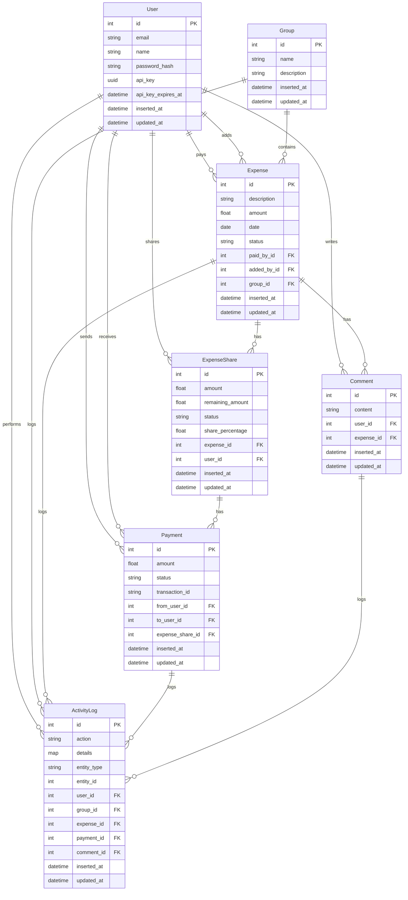

# Splitwise

A Phoenix-based expense sharing application that helps users track shared expenses and balances with housemates, trips, groups, friends, and family.

## Features

- Create and manage expenses
- Split expenses equally or by custom amounts
- Track who owes what
- Group expenses by categories
- Real-time activity logging
- Payment tracking
- Comment system for expenses

## Prerequisites

- Docker and Docker Compose
- Elixir 1.14+ and Erlang 24+
- PostgreSQL 13+

## Running with Docker

1. Clone the repository:
```bash
git clone https://github.com/vakharia-deep/splitwise-apis.git
cd splitwise
```

2. Build and start the containers:
```bash
docker-compose up --build
```

3. Run database migrations:
```bash
docker-compose exec web mix ecto.migrate
```

4. Create a database seed:
```bash
docker-compose exec web mix run priv/repo/seeds.exs
```

The application will be available at `http://localhost:4000`

## Running Locally

1. Install dependencies:
```bash
mix deps.get
```

2. Create and migrate your database:
```bash
mix ecto.create
mix ecto.migrate
```

3. Start Phoenix server:
```bash
mix phx.server
```

Now you can visit [`localhost:4000`](http://localhost:4000) from your browser.

## Database Schema



## Seeded Users

The following users are automatically created when you run the database seeds:

| Name | Email | API Key |
|------|-------|---------|
| John Doe | john@example.com | c94e9832-6422-4131-b73c-4955ae40eeb6 |
| Jane Smith | jane@example.com | 2e4e9ee9-b3e4-4878-bfbb-b6d3c4e13802 |
| Bob Johnson | bob@example.com | b909a804-9602-49d2-825e-69950b4475ba |
| Alice Brown | alice@example.com | d92706b7-fd4b-4055-a665-20a893dcdf22 |
| Charlie Wilson | charlie@example.com | bb2ce2ed-5bd1-49ba-8304-c5756d38f132 |


## License

This project is licensed under the MIT License - see the LICENSE file for details.

## Learn more

  * Official website: https://www.phoenixframework.org/
  * Guides: https://hexdocs.pm/phoenix/overview.html
  * Docs: https://hexdocs.pm/phoenix
  * Forum: https://elixirforum.com/c/phoenix-forum
  * Source: https://github.com/phoenixframework/phoenix
